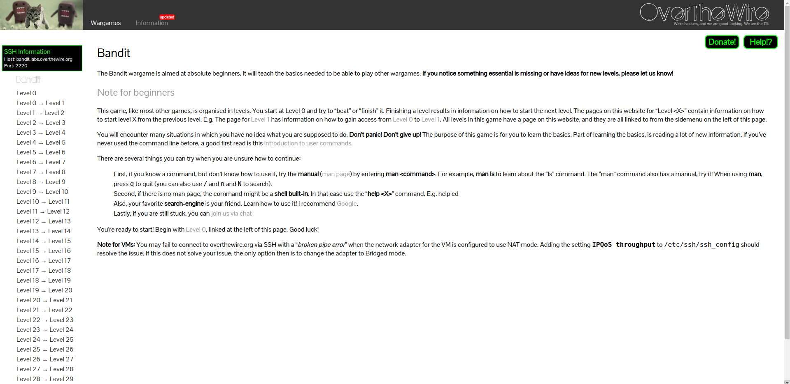
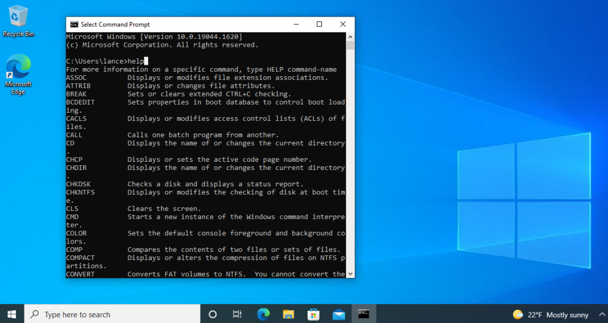
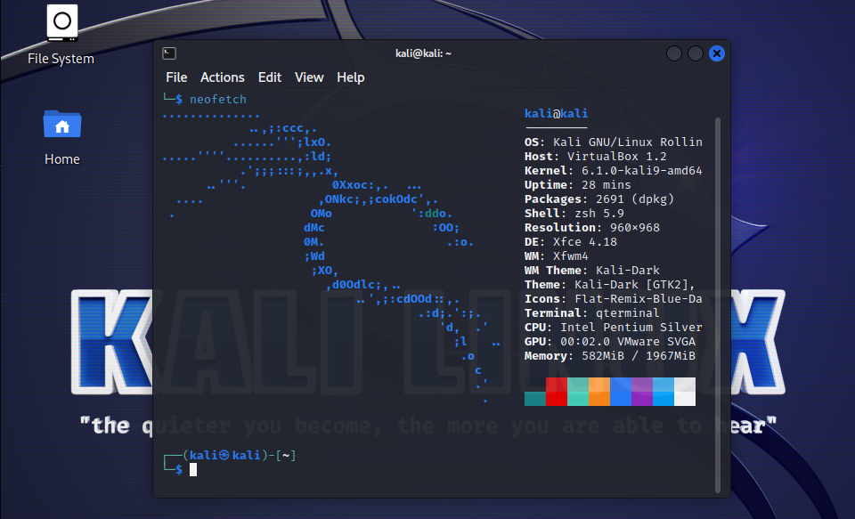

# OverTheWire Bandit - A Walkthrough

## Table of Contents
- [An Overview](#Overview)
- [An Introduction](#Introduction)
- [Level 0](#Level0)

## An Overview 

OverTheWire is a website which hosts wargames. A wargame is a cyber-security challenge which involves the application of actual cyber-security concepts and tools in order to accomplish some sort of goal. This goal is usually capturing a flag (acquiring a special key hidden within a system). This differs from tests and exams, which are usually knowledge-based. Wargames are far more focused on your applicable skills.

Bandit is OverTheWire's introductory wargame. With Bandit, there are 33 "levels". Each "level" is a machine that the user can connect to. Each machine contains a flag, which is a file that contains text. When you start level 0, you connect to the level 0 machine and acquire the flag. Then you connect to the level 1 machine, and you input the flag you found at level 0 as the password to access the machine. With each machine, finding the flag gets more challenging. 

By navigating through the different levels of Bandit, players are exposed to a variety of Linux command-line tools and techniques commonly used in cyber-security. Each level presents a unique challenge where the player must use their knowledge of Linux commands and system administration to find hidden flags.

## An Introduction 

The Bandit wargame can be accessed on OverTheWire's website. 

The specific webpage can be accessed via this link: https://overthewire.org/wargames/bandit/

The introductory page gives you a basic overview of the wargame. You could give the webpage a quick read, but the information basically boils down to:
- Each level page contains important information on finding the flags.
- The left sidebar contains the navigation for each level, you progress from level 0 upwards to level 33.
- You're going to have to use command-line commands.
- When you are stuck, you should search online for help, and **try harder**.

Note the part where the webpage introduction says that you're going to need to use command-line commands. What are command-line interfaces?  

What you're seeing in the screenshots above are examples of command-line interfaces. The first screenshot shows you the Command Prompt on Windows 10. The user inputted the 'help' command, which returns a list of common commands on Windows. The second screenshot shows you a Linux terminal. The user inputted the 'neofetch' command, which returned some system information. 

You can find these command-line interfaces on any consumer operating system (Windows, MacOS, Linux). They are special applications on your system which allow you to communicate with your system by inputting commands. When a typical user communicates with their system, they might click on a button or a graphic of some kind, or they'll search for an application to help them do something. A command-line interface allows you to just type in a command, and get the system to immediately execute upon that command without having to search for an application or particular button in the system settings. 

Command-line interfaces, though less accessible due to the knowledge of commands required, are a lot more efficient and flexible. Command-line interfaces will also often allow for scripting and automation, which means you can get your system to follow a sequence of commands or to automatically execute upon some commands. When it can be properly used, a command-line interface gives the user a lot of control over their system, being a very powerful tool. It is because of this that many important tools, especially those utilized in cyber-security, are developed specifically for command-line interfaces.  

Since Bandit requires the use of command-line tools, you need to open up your own command-line interface. These tools can be used on Windows and Mac systems, but the set up would be quite impractical. It's a lot more impractical to install a virtual machine, and use the virtual machine's command-line. For this walkthrough, we're going to be using a Kali Linux virtual machine. 

Setting up a virtual machine is pretty simple, here's a brief setup plan for you:
- Link to download to virtual machine software, VirtualBox: https://www.virtualbox.org/wiki/Downloads
- Link to download the specific Kali Linux virtual machine software: https://www.kali.org/get-kali/#kali-virtual-machines
- Link to a simple guide on quickly setting the virtual machine up: https://www.kali.org/docs/virtualization/import-premade-virtualbox/

By the end of this, you should have your own Kali Linux virtual machine, which you can use for any wargame, CTF, or other pentesting endeavours.

## Level 0 

### Connecting to the Machine with SSH

In order to connect to the machine, we need to use SSH. SSH (Secure Shell) is a tool that allows a user on one computer to remotely access the command-line interface of another computer. 

Locate the terminal on your virtual machine, and type in SSH.